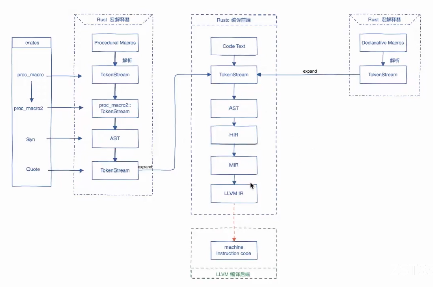
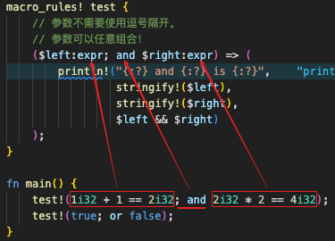

### 资料

- [rust 中文书](https://rustwiki.org/)
- [rust 迷你数据库项目](https://github.com/rosedblabs/rust-practice)
- [Rust 数据内存布局](https://mp.weixin.qq.com/s/GVlLBvaprI75d-GkE2P_QA)
- [rust 文章集](https://github.com/rust-boom/rust-boom)
- [过程宏练习项目](https://github.com/dtolnay/proc-macro-workshop) [Rust 过程宏开发实战系列](https://www.bilibili.com/video/BV16A411N7m2/?spm_id_from=333.337.search-card.all.click&vd_source=41ed998ac767425fb616fd9071ce9682)

### 宏

Rust 提供了一个强大的宏系统，可进行元编程,简单来说宏就是提供一种可可以解析代码并注入代码的能力,宏并不产生函数调用，而是展开成源码，并和程序的其余部分一起被编译

这个是 rust 的编译过程


> proc-macro2,是将 TokenStream 转化成更加易用的抽象,将类似 proc-macro 的功能引入其他上下文，如 build.rs 和 main.rs。还有就是提供单元测试功能. 现在 proc-macro2 不是必须的

也可以在`play.rust-lang.org`这里查看 rust 最终编译的结果.

宏又分为 过程宏 和 声明宏,这个两个宏需要不同的解析器来对其进行解析

#### 声明宏

声明宏 相对于 过程宏来说要相对简单,而且 声明宏 语句匹配规程类似于正则表达式的匹配方式,就比如下面这个 声明宏 里面

```rust
macro_rules! test {
    // 参数不需要使用逗号隔开。
    // 参数可以任意组合！
    ($left:expr; and $right:expr) => (
        println!("{:?} and {:?} is {:?}",
                 stringify!($left),
                 stringify!($right),
                 $left && $right)
    );
}

fn main() {
    test!(1i32 + 1 == 2i32; and 2i32 * 2 == 4i32);
    test!(true; or false);
}
```

- expr 用于表达式
- ident 表示标识符,如函数名,属性名等

其他的占位捕获词 https://rustwiki.org/zh-CN/rust-by-example/macros/designators.html, [全部指示符](https://doc.rust-lang.org/reference/macros-by-example.html)



#### 过程宏

结合上面 rust 编译过程的图来说,过程宏应该接受 `TokenStream` 并通过`Syn` 将其重新解析成功 AST 在对 AST 进行转化后通过 `quote` 再转回为 `TokenStream`返回, 这样才能让它再次混入回编译的源码 `TokenStream` 中

```rust
use proc_macro;

#[some_attribute]
pub fn some_name(input: TokenStream) -> TokenStream {
}
```

**为什么过程宏必须定义在一个独立的 crate 中?为什么不能在一个 crate 中即定义过程宏又实用过程宏**

原因:考虑过程宏是在编译一个 crate 之前对 crate 的代码进行加工的一段程序,这段程序也是需要编译后执行的. 如果定义过程宏和实用过程宏的代码写在一个 crate 中,那就回陷入死锁.

-> 要编译的代码首先需要运行过程宏来展开,否则代码是不完整的,没法编译 crate.
-> 不能编译 crate,crate 中的过程宏代码就没法执行,就不能展开被过程宏装饰的代码

创建一个项目,然后创建一个宏 crate

```shell
cargo new proc_macro_proj
cd proc_macro
cargo new --lib my_proc_macro
```

然后修改`my_proc_macro/Cargo.toml`中添加`[lib]`节点,并添加依赖

```toml
[dependencies]
proc-macro = "1.0.7"
quote = "1"
syn = {version = "1.0.56",feature = ["full","extra-traits"]}

[lib]
proc-macro = true
```

这样表示这个 crate 是一个 proc-macro,增加这个配置之后,这个 crate 的特性就会发生一些变化,例如,这一个 crate 将只能对外导出内部定义的过程宏,而不能导出内部定义的其他内容

然后将过程宏和项目关联起来,在`proc_macro_proj/Cargo.toml`中添加依赖

```toml
[dependencies]
my_proc_macro = {path = "./my_proc_macro"}
```

过程宏也有区分

- `#[proc_macro_attribute]`是在告诉编译器我们在定义一个 属性式 的过程宏
- `#[proc_macro]`用于定义 函数式 过程宏
- `#[proc_macro_drive]`用于定义 派生式过程宏

过程宏的本质就是一个编译环节的过滤器,或者说是一个中间件,它接收一段用户编写的源代码,做一同操作之后返回给编译器一段经过修改的代码.

> 另外,因为宏的执行是在编译过程中执行的,所以没有很好的办法去进行调试,并且实用`print`进行打印的时候也是会被吞掉的,可以使用`eprint`来打印

其实写宏并不一定需要`syn`和`quote`包,下面这个过程宏一样是可以运行的,使用这两个包的原因是`syn`可以将 TokenStream 转化成更加易用读懂和更加符合 rust 规范的的数据结构(AST),而 quote 这是方便我们自定义新代码,而不用进行麻烦的字符串拼接.

```rust
// my_proc_macro
#[proc_macro]
pub fn sql(input: TokenStream) -> TokenStream {
    "fn hello() {println!(\"hello world\");}".parse().unwrap()
}

// proc_macro_proj
fn main() {
    sql!(select * from table1 where id = 100 and count = 1 order by time desc);
    hello();
}
```
